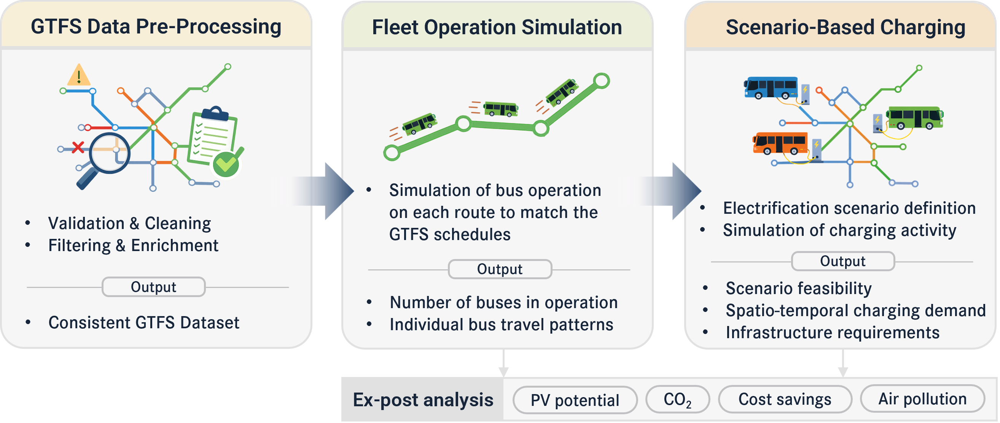

<center>
    
</center>

[](https://badge.fury.io/py/gtfs4ev)
[](https://pypi.org/project/gtfs4ev/)
[](https://www.gnu.org/licenses/gpl-3.0)
[](https://github.com/gtfs4ev/gtfs4ev)
[](https://github.com/gtfs4ev/gtfs4ev/actions)
[](https://gtfs4ev.github.io/gtfs4ev/)

`GTFS4EV` is an open-source Python tool designed to support the planning of public bus electrification. By leveraging the standardized General Transit Feed Specification (GTFS), it allows planners and researchers to quickly simulate bus operations and explore electrification scenarios without requiring proprietary or vehicle-level operational data. It bridges the gap between detailed agent-based simulators and simplified first-order calculators, providing a modular workflow for GTFS data pre-processing, fleet operation and charging simulation, and ex-post analysis of impacts (CO₂ savings, exposure to air pollution, fuel cost savings) and the potential integration of photovoltaic energy.

The tool can be imported as a python library or used with a command-line interface (CLI). The API of `GTFS4EV` has been designed in an object-oriented manner and is easily extendable. 

## Key Features and Workflow

The core functionality of GTFS4EV spans three main dimensions, which together form also the high-level simulation workflow (see Figure 1):

1. **GTFS data pre-processing**: GTFS data validation and cleaning.
2. **Fleet operation simulation**: Data-based simulation of bus fleet operations, estimating the number of vehicles in operation and their travel patterns.
3. **Scenario-based charging**: Spatio-temporal charging demand, scenario feasability, and infrastructure requirements (required number of chargers, required bus battery capacities) under user-defined electrification scenarios (i.e., available charging powers, charging strategy, and electric bus energy consumption)

<br>


*Figure 1: The GTFS4EV three-step workflow: GTFS data pre-processing, fleet simulation, and scenario-based charging.*

<br>

Other **standout features**:
* GTFS data filtering (e.g. suppression of specific services) or enrichment (e.g. addition of extra idle times at stops or terminals).
* PV integration potential: Assess charging demand alignment with local solar PV generation.
* Ex-post impact analysis (CO₂ savings, spatial air pollution reduction, and fuel cost savings).
* Supports multiple charging strategies applied in sequence. The model starts with the first strategy and falls back to the next one if charging needs are not met, ensuring flexible charging simulations.
* Visualisation of spatial charging demand as HTML maps 
* Dual usage: Use as a CLI or as a modular Python library.

## Authors 

`GTFS4EV` is initally developed by EPFL (Switzerland), within the Photovoltaics and Thin Film Electronics Laboratory (PV-Lab). 

Main authors: Jeremy Dumoulin (jeremy.dumoulin[at]epfl.ch), Alejandro Pena-Bello, Noémie Jeannin, Nicolas Wyrsch

## Installation

It is recommended to use a a dedicated virtual environment. See for instance the creation of a virtual environment [with pip and venv](https://packaging.python.org/en/latest/guides/installing-using-pip-and-virtual-environments/) or [with conda](https://docs.conda.io/projects/conda/en/stable/user-guide/getting-started.html). `GTFS4EV`  has been tested with Python 3.12 and 3.13. 

`GTFS4EV` is available as a PyPI package and can be installed via pip with:

```bash
pip install gtfs4ev
```

For developers, the model can be installed with:

```bash
git clone https://github.com/gtfs4ev/gtfs4ev.git
cd gtfs4ev
pip install -e .
```

## Quick start

### As a command-line interface

Get the GTFS data ready for your case study and populate a new configuration file with input values for your case study (see existing examples that you can copy and use as a blueprint in the `/example` folder). Note that GTFS data needs to be provided as a folder, not a .zip file.

Once both your data and configuration file are ready, open a terminal, activate your virtual environment (optional), and run:
```bash
$ gtfs4ev
```
You’ll be prompted to enter the path to your config file:
```bash
$ Enter the path to the python configuration file: C:\Users\(...)\config.py
```
> :warning: Use absolute paths in the config file, or start the terminal in the same directory as the config file to use relative paths.

### As a Python library

```python
from gtfs4ev.gtfsmanager import GTFSManager
from gtfs4ev.fleetsimulator import FleetSimulator
from gtfs4ev.chargingsimulator import ChargingSimulator

# Load GTFS data
gtfs = GTFSManager(gtfs_datafolder="path/to/your/gtfs_folder")

# Check and clean GTFS feed if needed
if not gtfs.check_all():
    gtfs.clean_all()

# Simulate fleet operation (all trips)
fleet_sim = FleetSimulator(gtfs_manager=gtfs)
fleet_sim.compute_fleet_operation()

# Define and compute a simple charging scenario
charging = ChargingSimulator(
    fleet_sim=fleet_sim,
    energy_consumption_kWh_per_km=0.39,
    battery_capacity_kWh=50,
    charging_powers_kW={
        "depot": [[11, 0.5], [22, 0.5]],
        "terminal": [[150, 1.0]]
    }
)

charging.compute_charging_schedule(
    strategies=["terminal_random", "depot_night"],
    charge_probability_terminal=0.5, # Probability of charging when arriving at a terminal
    depot_travel_time_min=[30,15] # [Average, standard deviation] time to reach the depot after operating hours 
)

# Example output - charging schedule per vehicle
charging.charging_schedule_pervehicle.to_csv(f"path/to/your/output_folder/charging_schedules.csv", index=False)

# Example outputs - Generate aggregated charging load curve
load_curve = charging.compute_charging_load_curve(time_step_s=60)
load_curve.to_csv(f"path/to/your/output_folder/load_curve.csv", index=False)
```

> :bulb: We recommend starting by looking at the full documentations and examples to get familiar with the workflow, inputs . The easiest way to access all necessary files is to download the full GitHub repository as a ZIP file, extract it and copy the contents of the example folder into the directory of your choice.

## Documentation

For detailed information about the model and its usage, please see the [documentation](https://gtfs4ev.github.io/gtfs4ev/). The documentation also contains step-by-step guide to the examples available in the `examples/` folder.

## Suggestions and contributions

We welcome any contributions or suggestions! Please see our Contributing Guidelines. If you encounter a bug or have a feature request, please open an issue.

## Acknowledgment 

This project was supported by the HORIZON [OpenMod4Africa](https://openmod4africa.eu/) project (Grant number 101118123), with funding from the European Union and the State Secretariat for Education, Research and Innovation (SERI) for the Swiss partners. We also gratefully acknowledge the support of OpenMod4Africa partners for their contributions and collaboration.

## License

[GNU GENERAL PUBLIC LICENSE](https://www.gnu.org/licenses/gpl-3.0.html)
