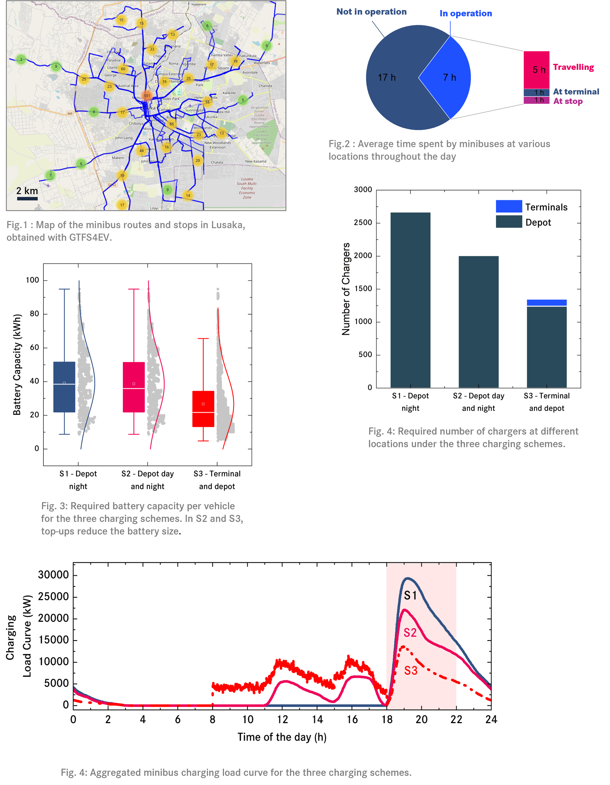

<center>
    
</center>

[](https://badge.fury.io/py/gtfs4ev)
[](https://pypi.org/project/gtfs4ev/)
[](https://www.gnu.org/licenses/gpl-3.0)
[](https://github.com/gtfs4ev/gtfs4ev)
[](https://gtfs4ev.github.io/gtfs4ev/)

`GTFS4EV` is an open-source Python tool designed to support the planning of public bus electrification. By leveraging the standardized [General Transit Feed Specification (GTFS)](https://gtfs.org/), it allows planners and researchers to quickly simulate bus operations and explore electrification scenarios without requiring proprietary or vehicle-level operational data. It bridges the gap between detailed agent-based simulators and simplified first-order calculators, providing a modular workflow for GTFS data pre-processing, fleet operation and charging simulation, and ex-post analysis of impacts (CO₂ savings, exposure to air pollution, fuel cost savings) and the potential integration of photovoltaic energy.

The tool can be imported as a Python library or used with a command-line interface (CLI). The API of `GTFS4EV` has been designed in an object-oriented manner and is easily extendable. 

## Key Features and Workflow

The core functionality of `GTFS4EV` spans three main dimensions, which together form also the high-level simulation workflow (see Figure 1):

1. **GTFS data pre-processing**: GTFS data validation and cleaning.
2. **Fleet operation simulation**: Data-based simulation of bus fleet operations, estimating the number of vehicles in operation and their travel patterns.
3. **Scenario-based charging**: Spatio-temporal charging demand, scenario feasibility, and infrastructure requirements (required number of chargers, required bus battery capacities) under user-defined electrification scenarios (i.e., available charging powers, charging strategy, and electric bus energy consumption)

<br>


*Figure 1: The GTFS4EV three-step workflow: GTFS data pre-processing, fleet simulation, and scenario-based charging.*

<br>

Other **standout features**:
* GTFS data filtering (e.g. suppression of specific services) or enrichment (e.g. addition of extra idle times at stops or terminals).
* PV integration potential: Assess charging demand alignment with local solar PV generation.
* Ex-post impact analysis (CO₂ savings, spatial air pollution reduction, and fuel cost savings).
* Flexible charging strategy support: Includes built-in charging strategies with also the option for users to implement custom strategies.
* Supports multiple charging strategies applied in sequence. The model starts with the first strategy and falls back to the next one if charging needs are not met. This approach allows building a complex charging logic by layering simpler strategies without needing to rewrite or duplicate code.
* Spatial visualization of transport network and charging demand as HTML maps 
* Dual usage: Use as a CLI or as a modular Python library for advanced analysis.

## Documentation

For detailed information about the model, its usage, and the API, please see the [documentation](https://gtfs4ev.github.io/gtfs4ev/). The documentation also contains step-by-step guides to the minimal working examples available in the `examples/` folder.

## Authors 

`GTFS4EV` is initially developed by EPFL (Switzerland), within the Photovoltaics and Thin Film Electronics Laboratory (PV-Lab). 

Main authors at the initiative of GTFS4EV: Jeremy Dumoulin (jeremy.dumoulin[at]epfl.ch), Alejandro Pena-Bello, Noémie Jeannin, Nicolas Wyrsch

## Installation

It is recommended to use a dedicated virtual environment. See for instance the creation of a virtual environment [with pip and venv](https://packaging.python.org/en/latest/guides/installing-using-pip-and-virtual-environments/) or [with conda](https://docs.conda.io/projects/conda/en/stable/user-guide/getting-started.html). `GTFS4EV` has been tested with Python 3.12. 

`GTFS4EV` is available as a PyPI package and can be installed via pip with:

```bash
pip install gtfs4ev
```

For users who want to work with the development version or modify the code:

```bash
git clone https://github.com/gtfs4ev/gtfs4ev.git
cd gtfs4ev
pip install -e .
```

## Quickstart

For a step-by-step example, see the [Quickstart Guide](https://gtfs4ev.github.io/gtfs4ev/getting-started/quickstart/).

### As a command-line interface

Get the GTFS data ready for your case study and populate a new configuration file with input values for your case study (see existing examples that you can copy and use as a blueprint in the `/example` folder). Note that GTFS data needs to be provided as a folder, not a .zip file.

Once both your data and configuration file are ready, open a terminal, activate your virtual environment (optional), and run:
```bash
$ gtfs4ev
```
You’ll be prompted to enter the path to your config file:
```bash
$ Enter the path to the python configuration file: C:\Users\(...)\config.py
```
> :warning: Use absolute paths in the config file, or start the terminal in the same directory as the config file to use relative paths.

### As a Python library

```python
from gtfs4ev.core.gtfsmanager import GTFSManager
from gtfs4ev.core.fleetsimulator import FleetSimulator
from gtfs4ev.core.chargingsimulator import ChargingSimulator

# Load GTFS data
gtfs = GTFSManager("path/to/GTFS_folder")

# Simulate fleet operation for all trips
fleet = FleetSimulator(gtfs)
fleet.compute_fleet_operation()

# Define and run a simple charging scenario
charging = ChargingSimulator(
    fleet_sim=fleet,
    energy_consumption_kWh_per_km=0.39,
    security_driving_distance_km=0, 
    charging_powers_kW={"depot":[[11,0.5],[22,0.5]],"terminal":[[150,1.0]]}
)
charging.compute_charging_schedule(
    charging_strategies=["terminal_random","depot_night"],
    charge_probability_terminal=0.5,
    depot_travel_time_min=[30,15]
)

# Export results
charging.charging_schedule_pervehicle.to_csv("path/to/output/charging_schedules.csv",index=False)
charging.compute_charging_load_curve(time_step_s=60).to_csv("path/to/output/load_curve.csv",index=False)

```

> :bulb: We recommend starting by looking at the full documentation and examples to get familiar with the simulation workflow, inputs and outputs. The easiest way to access all necessary files is to download the full GitHub repository as a ZIP file, extract it and copy the contents of the example folder into the directory of your choice.

## Examples

Below are selected outputs derived from a case study of Lusaka’s minibus taxi fleet (detailed in this [report](docs/cases/GTFS4EV_Lusaka_report_open.pdf)). These examples illustrate typical analyses such as:

 - Characterization of the existing minibus network
 - Analysis of fleet operation
 - Required battery capacities and number of charger in different charging scenarios
 - Aggregated charging load in different charging scenarios



More examples and related scientific work can be found in the [References section](https://gtfs4ev.github.io/gtfs4ev/appendix/references/) of the full documentation.

## Suggestions and contributions

We welcome any contributions or suggestions! Please see the [Contributing section](https://gtfs4ev.github.io/gtfs4ev/appendix/contributing/) of the full documentation. If you encounter a bug or have a feature request, please open an issue.

## Acknowledgments 

This project was supported by the HORIZON [OpenMod4Africa](https://openmod4africa.eu/) project (Grant number 101118123), with funding from the European Union and the State Secretariat for Education, Research and Innovation (SERI) for the Swiss partners. We also gratefully acknowledge the support of OpenMod4Africa partners for their contributions and collaboration.

## License

[GNU GENERAL PUBLIC LICENSE](https://www.gnu.org/licenses/gpl-3.0.html)
