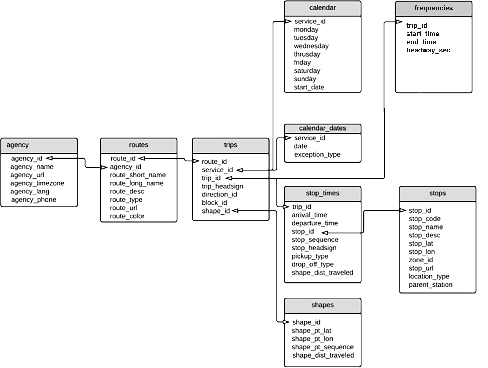
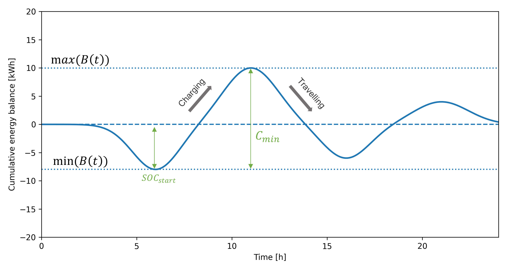

# Core Workflow

This page describes the **key methodological aspects** of the GTFS4EV core workflow, structured around its three main steps: GTFS data pre-processing, fleet operation simulation, and scenario-based charging.

---

## GTFS data pre-processing

GTFS data pre-processing constitutes the **first step** of the GTFS4EV workflow. This step ensures that the input data are represented as a **complete, consistent, and simulation-ready** data. It also provides additional data manipulation features, such as restricting the analysis to specific operating services or agencies, introducing idle times when these are not explicitly present in the original feed, and producing transit analyses and visualizations.

From a methodological perspective, this step defines the interface between raw data and input data suitable for simulation.

### About GTFS data

The static General Transit Feed Specification (GTFS) is a standard data format with a **relational structure** used to describe public transport schedules and networks. As shown in Fig. 1, a GTFS feed consists of multiple text files, each representing a specific aspect of the transport system (e.g. agencies, trips, shapes, etc).

*Figure 1: Overview of GTFS data structure, showing the link between each table through identifiers.*

These tables are linked through identifiers, and their correct interpretation relies strongly on the **consistency of these links across files**. As a result, additional validation and cleaning is recommended before the data can be used for simulation-based analyses.

> **Note:** While the `frequencies.txt` file is formally optional in the GTFS specification, GTFS4EV relies on headway-based service representations for fleet operation simulation. Hence, GTFS feeds in which every trip is defined as an individual trip (i.e. without a corresponding frequency-based representation), are not supported by the current simulation logic.

### Method for ensuring internal consistency

A key methodological feature of the GTFS data pre-processing stage is to ensure **internal consistency across all GTFS tables**. For simulation-ready analyses, the input data must form **a closed system of mutually referenced entities**. Hence, agencies, routes, services, trips, stop times, stops, shapes, and frequencies must all be connected through valid references, with no isolated or incomplete elements.

The consistency process therefore follows two complementary principles:

1. **Systematic validation of cross-table references**  
   Each GTFS table is checked against the ones it is linked to others to verify that all identifiers point to existing entities. 

2. **Iterative removal of inconsistencies**  
   When inconsistencies are detected, entities that cannot be simulated are removed. Because removing one element may create new inconsistencies elsewhere, the cleaning process is applied **iteratively** until the dataset reaches a stable state in which all remaining elements are mutually consistent.

This iterative cleaning strategy is intentionally restrictive. Trips that lack essential information for fleet operation simulation are removed, and subsequently any remaining entities that are no longer referenced by the retained trips.

---

## Fleet operation simulation

Fleet operation simulation constitutes the **second core step** of the GTFS4EV workflow. Its objective is to transform static, schedule-based GTFS information into a **dynamic representation of vehicle operations** across all trips in the network.

The overall fleet operation is obtained by repeating the **same simulation procedure for each GTFS trip**. Trips are therefore treated **independently**, and the simulation logic is applied separately to each trip contained in the dataset. This constitutes an important modeling assumption: **every vehicle is operating on only one trip throughout the day**. While restrictive, this assumption enables a transparent and computationally efficient representation of fleet activity and is well suited for energy demand and charging analyses.

From a methodological perspective, fleet operation simulation for a single trip relies on a **two-level approach**:

1. **Travel event sequence for a vehicle on a given trip**
   Vehicle behavior along a given GTFS trip is simulated in detail, resulting in a **travel event sequence** that describes stops, terminals, and travelling segments, together with their associated durations, distances, and geometries.

2. **Fleet-level operation based on service frequencies**
   Based on the travel event sequence, the **number of vehicles required** and their **dispatch over time and space** are simulated according to the headway-based service definitions provided in `frequencies.txt`. This step results in a complete description of the **operation of all vehicles assigned to the trip** over the service day.

### Travel event sequence for a vehicle on a given trip

For a given trip, the simulation constructs a travel event sequence through:

1. **Temporal and spatial normalization**: Stop times are ordered and expressed relative to the trip start, and stop locations are projected onto the associated route geometry. This ensures consistency in time and space while removing dependence on absolute clock time and shape orientation.

2. **Event-based decomposition of the trip**: The trip is represented as a sequence of discrete events, each defined by:

      * A status (at_terminal, at_stop, or travelling)
      * A duration
      * A distance traveled (for travelling events only)
      * A geometry (point or line segment)

This event-based representation constitutes the core abstraction of vehicle behavior along a trip.

### Fleet-level operation based on service frequencies

Once the travel event sequence has been established, it is expanded into a **fleet-level operation** using the headway-based service definitions provided in `frequencies.txt`. For each frequency period associated with the trip, the following logic is applied:

1. **Estimation of required fleet size**  
   The number of vehicles $N$ operating on the trip is estimated based on the total duration of the trip ($T_{\text{trip}}$) and the headway time ($h$) for a given service frequency period ($\lceil \cdot \rceil$ is a ceiling function): 
   
   $$
   N = \left\lceil \frac{T_{\text{trip}}}{h} \right\rceil
   $$  

2. **Vehicle injection and circulation logic**  
   Vehicles are assigned staggered start times based on the headway. Two operating regimes are supported:

      * *Steady-state regime*, in which vehicles are assumed to be already dispatched along the trip at the beginning of the service window  
      * *Transient regime*, in which vehicles progressively enter service after the start time  

3. **Partial trip handling at service boundaries**  
   Trips that overlap the start or end of a frequency period are clipped in time. This ensures temporal consistency while avoiding artificial truncation effects.

4. **Vehicle operation schedeule and vehicle-level indicators**  
   For each vehicle, the simulation generates for every vehicle a complete operating schedule over the day, along with vehicle-level indicators (total distance traveled, total operating time, time spent travelling, stopping, and idling at terminals)

The output of this step is a **compact fleet operation representation**, with one record per vehicle, along with some vehicle-level metrics.

---

## Scenario-based charging

Scenario-based charging constitutes the **third core step** of the workflow. Its main objective is to translate simulated fleet operations into **vehicle-level charging schedules**, under a set of explicitly defined charging assumptions. This step enables the exploration of alternative **charging scenarios** that differ in charging locations, charging power availability, charging strategies (behavioral rules), and prioritization strategies.

From a methodological perspective, scenario-based charging operates as a **post-processing layer** applied to the fleet operation simulation. Vehicle operations are not altered; instead, energy consumption and charging behavior are constructed based on the detailed vehicle operation schedules obtained from fleet simulation.

### Vehicle-level energy demand

For each simulated vehicle, the **travel sequence** is reconstructed by combining operating and non-operating periods (travelling, stops, terminals, depot idle times). Based on this sequence, the vehicle’s daily energy need is computed as:

$$
E_{\text{need}} = \sum_{i} d_i \cdot e_{\text{km}} + d_{\text{sec}} \cdot e_{\text{km}}
$$

where:

- $d_i$ is the distance traveled during travel event $i$  
- $e_{\text{km}}$ is the vehicle energy consumption rate (kWh/km)  
- $d_{\text{sec}}$ is an optional **security driving distance** representing operational margins  

### Charging strategies

Charging behavior is defined through one or several **charging strategies**, applied sequentially and in priority order. A charging strategy is therefore characterized by:

1. **A set of charging strategies**, such as: opportunistic charging at terminals or stops, daytime depot charging during non-operating periods, etc

2. **Behavioral parameters**: charging decisions at stops or terminals, restrictions to specific terminal, optional travel-time to the depots

3. **Charging power availability**, defined through discrete charging power options and their selection probabilities for each location type (e.g. depot, terminal, stop).

For a given vehicle, each charging strategy scans the travel sequence to *generate charging events* subject to the following constraints:

- Available dwell time $\Delta t$
- Selected charging power $P$
- Remaining unmet energy demand $E_{\text{rem}}$
- No temporal overlap with previously assigned charging events

The energy charged during a single charging event $j$ is computed as:

$$
E_j = \min \left( P_j \cdot \Delta t_j,\; E_{\text{rem}} \right)
$$

If different charging strategies are provided, they are applied sequentially until the total energy requirement is met or no further charging opportunities are available.

### Evaluation of charging feasibility

For each vehicle, the feasibility of a charging scenario is evaluated by comparing the **total energy charged** to the vehicle’s daily charging demand. At the trip and fleet level, the **share of feasible charging schedules** can also be derived.

### Battery capacity implications

Beyond charging schedules, scenario-based charging also derives **minimum battery capacity requirements** for every vehicle. By combining charging and driving events over the service day, the simulation reconstructs the vehicle’s cumulative energy balance:

$$
B(t) = \sum_{k \leq t} E_k^{\text{charge}} - \sum_{l \leq t} E_l^{\text{drive}}
$$

From this battery trajectory, two key indicators are derived. Fig. 2 provides a schematic illustration of the cumulative energy balance of a vehicle over a service day and the derivation of the associated battery requirements.

- The **minimum required battery capacity**:
  $$
  C_{\min} = \max(B(t)) - \min(B(t))
  $$

- The **minimum initial state of charge** required at the start of the day:
  $$
  \text{SOC}_{\text{start}} = -\min(B(t))
  $$

*Figure 2: Schematic representation of the cumulative energy balance \(B(t)\) of a vehicle over a 24-hour service day. Downward segments correspond to travelling events (energy consumption), while upward segments correspond to charging events. The minimum required battery capacity is given by the difference between the maximum and minimum values of \(B(t)\), while the minimum initial state of charge corresponds to the absolute value of the minimum of \(B(t)\).*

These indicators are **scenario-dependent** and enable direct comparison of charging strategies in terms of onboard storage needs.

### Per-stop charging demand and charger requirements

Charging events from all vehicles are aggregated at the **stop or depot level** to obtain a time-resolved representation of concurrent charging activity. For each location, overlapping charging sessions are combined to compute:

- The **instantaneous charging power** demand, enabling also the construction of **charging load curves** at different aggregation levels
- The **number of vehicles charging simultaneously**

The **maximum number of concurrently charging vehicles** at a given stop provides a direct proxy for the **minimum number of chargers** required at that location under the assumed scenario. 
